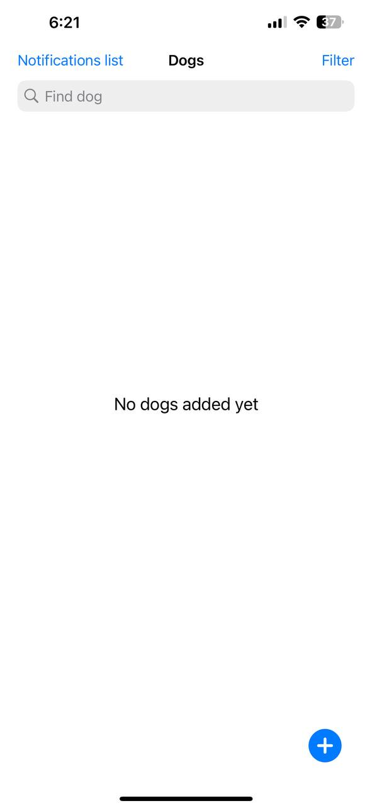
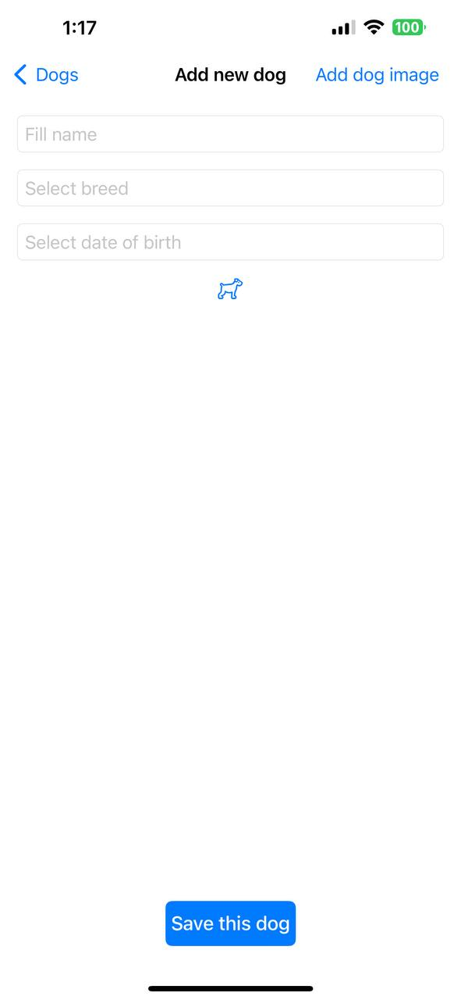
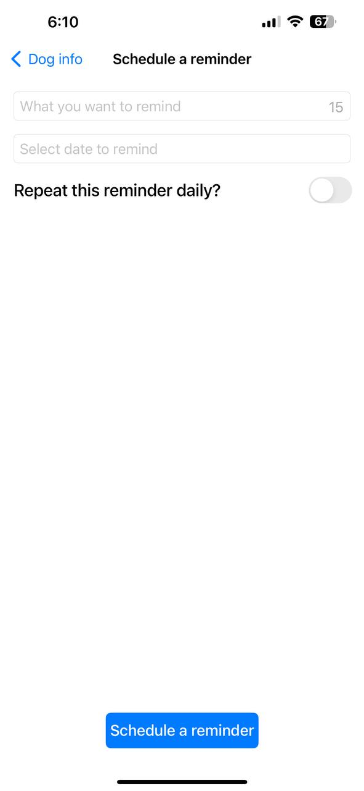
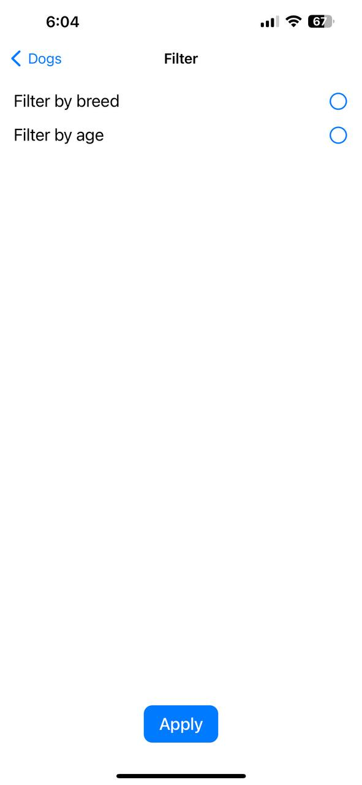
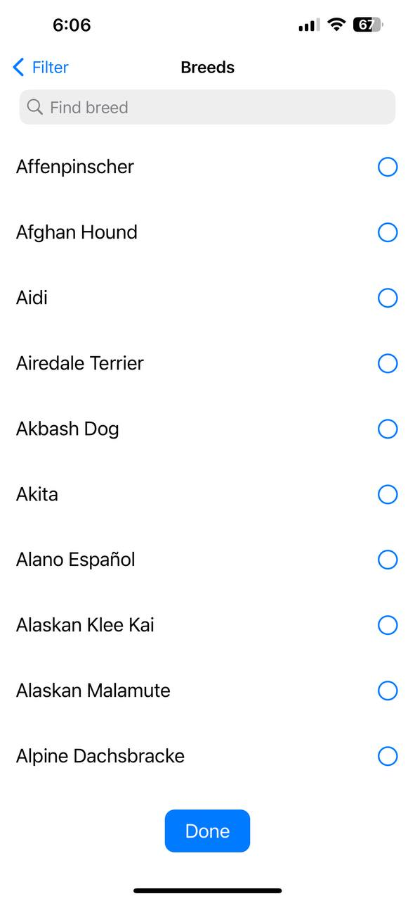
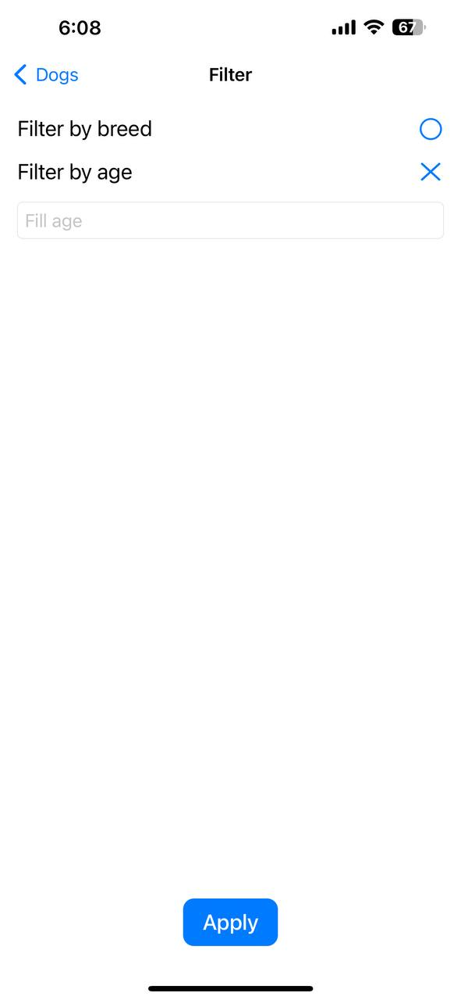

## Description

The purpose of the app is to keep track of the dogs currently in the real shelter.

Shelter app is implemented using the Model–View–ViewModel(MVVM) architecture pattern.
This app use:

1. CoreData
2. Local Notifications
3. Imported JSON file 

## Map

This main screen you can see when use app for first time.

To get started you have to click on the plus icon at the bottom right of the main screen
When adding a dog to the app you must fill following fields:
1. Name
2. Breed
3. Date of birth
4. Photo*

*if no photo is added, the default image will be used

Also you can click on the dog on main screen and open screen with detailed information about clicked dog

On this screen you can do some changes like:
1. Delete dog
2. Schedule a reminder

If you choose to schedule a reminder, such screen would be opened 

Where you can fill few text fields and choose whould be this reminder daily repeated

On the next screen, where you can move from main screen by click on button "Filter" at the top right of the screen, you can filter what dog yoy want to see.

filter screen includes such filters: 
1. Breed filter
2. Age filter

If click on the "Filter by breed" you will see such screen with the list of breeds:

Then if click on the "Filter by age" appear text field in which you can fill age:

The last one screen which can be opened from main screen is screen with list of all scheduled reminders. For open this one screen you should click on button "Notifications" at the top right of the screen. 

All notifications can be selected and deleted.

